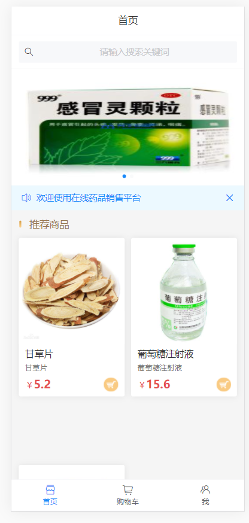
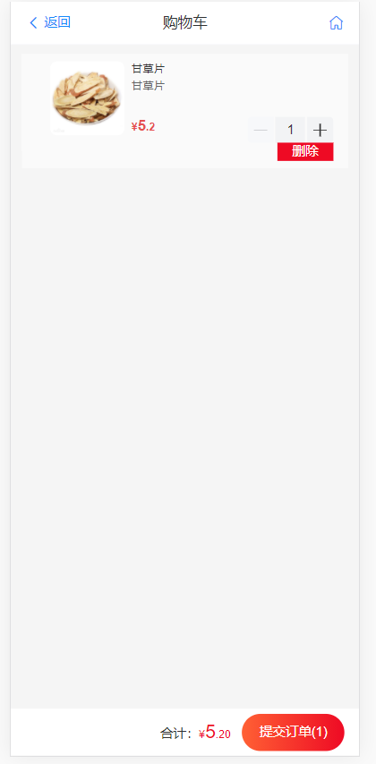
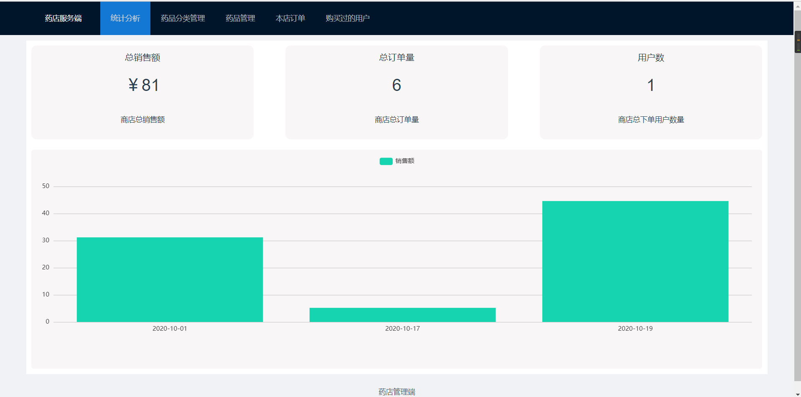
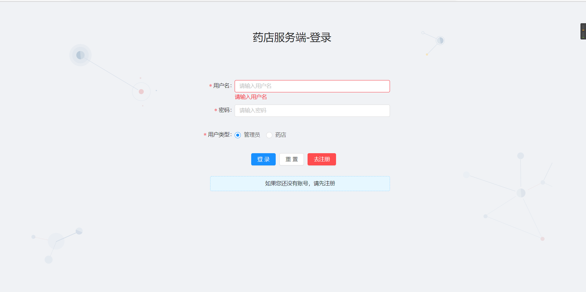

# 药店销售平台毕设项目
药店销售平台

## 安装nodejs  
node v12.18.4  
npm v6.14.8推荐使用cnpm安装速度快

在medicine-admin-web、medicine-back、medicine-mall-client目录中执行npm i安装依赖，等待依赖安装完成，在对应目录下执行npm run serve本地启动
1. medicine-admin-web:管理端  
访问地址：http://127.0.0.1:7777/
管理端分为 药店管理和药店药品订单用户管理  
后台服务medicine-back：  
    不需要用户操作，提供后台服务
药店管理medicine-admin-web：  
    注册 选择对应的用户类型，注册完后即可登录  
    登录 数据库中有用户名：root,admin 密码123，类型选择管理员登录后跳转到管理药店主页面  
药店药品管理medicine-admin-web：  
    注册:注册完成后直接申请需要药店管理同意申请并且资质审核通过才允许登录，一个用户对应一个药店 一对一关系    
    登录：需要选择正确的用户类型 用户名：abc,aa 分别为两个药店， 密码均为123，登录成功后可以做 药品分类，药品，订单，用户，销售额统计等操作    
药店客户端medicine-mall-client：  
    注册：注册成功后需要进行实名认证才能登录，选择证件类型，证件号码进行实名认证，保存成功后登录  
    登录：登录成功后可以搜索药品（通过药品名字，药店地址，药店名字均能搜索），加入购物车，下单，支付等    
    
2. medicine-back:后台服务  
端口：http://127.0.0.1:3000/
3. medicine-mall-client:客户端，客户端浏览器F12切换为手机模式   
端口：http://127.0.0.1:8066/

## 安装mysql
mysql v5.7+  
导入sql文件夹下面的sql到数据库中，数据库配置在medicine-back/config/config.js中，修改为自己的配置

  
  
  
  
  
