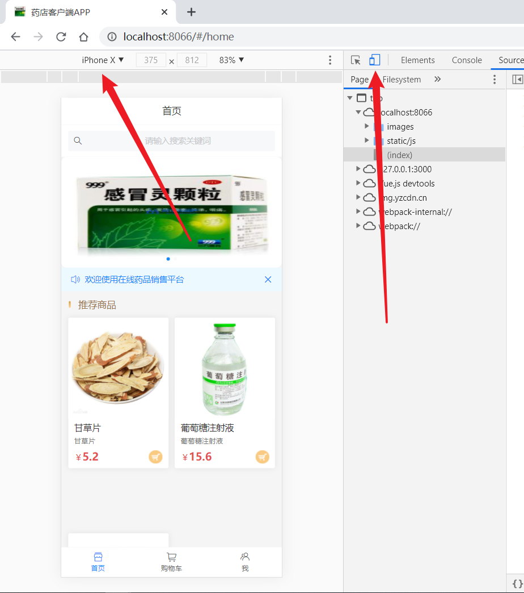
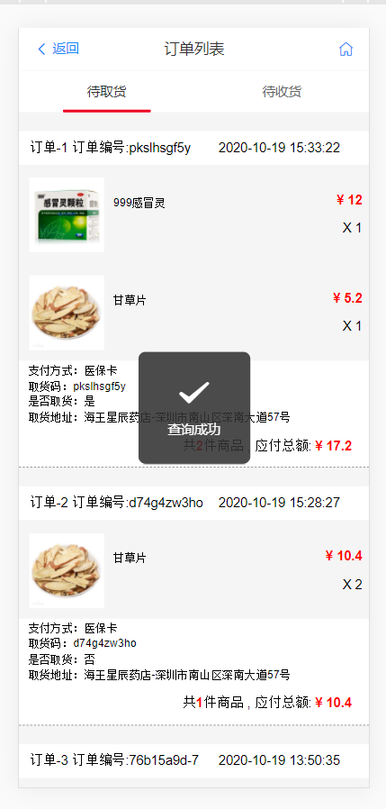

# 药店销售平台毕设项目
药店销售平台

## 安装nodejs  
node v12.18.4  
npm v6.14.8推荐使用cnpm安装速度快

在medicine-admin-web、medicine-back、medicine-mall-client目录中执行npm i安装依赖，等待依赖安装完成，在对应目录下执行npm run serve本地启动
1. medicine-admin-web:管理端  
访问地址：http://127.0.0.1:7777/
2. medicine-back:后台服务  
端口：http://127.0.0.1:3000/
3. medicine-mall-client:客户端，客户端浏览器F12切换为手机模式   
端口：http://127.0.0.1:8066/

## 安装mysql
mysql v5.7+  
导入sql文件夹下面的sql到数据库中，数据库名字配置在medicine-back/config/config.js中

  
  
  
  
  